  

<picture>
  <source media="(prefers-color-scheme: dark)" srcset="https://raw.githubusercontent.com/oneUTer/oneUTer/output/github-contribution-grid-snake-dark.svg" />
  <source media="(prefers-color-scheme: light)" srcset="https://raw.githubusercontent.com/oneUTer/oneUTer/output/github-contribution-grid-snake.svg" />
  
</picture>

  
  
  

## 01 / About

I'm a Computer Science graduate student focused on **Java backend development** and exploring **AI Agents**.

## 02 / Current Focus

<table>
  <tr>
    <td width="50%" valign="top">
      <h3>☕ Java Backend</h3>
      <ul>
        <li>Java fundamentals &amp; concurrency</li>
        <li>Spring Boot &amp; REST APIs</li>
        <li>MySQL, Redis &amp; Docker</li>
      </ul>
    </td>
    <td width="50%" valign="top">
      <h3>🤖 AI Agents</h3>
      <ul>
        <li>RAG &amp; source grounding</li>
        <li>Tool calling &amp; MCP</li>
        <li>Agent workflows &amp; evaluation</li>
      </ul>
    </td>
  </tr>
</table>

## 03 / Tools

  

  

## 04 / Research

My research focuses on battery **SOH estimation** and **EOL prediction**, using deep learning and time-series modeling.

  

---

  <a href="mailto:bowen_wei_hfut@163.com">bowen_wei_hfut@163.com</a>

